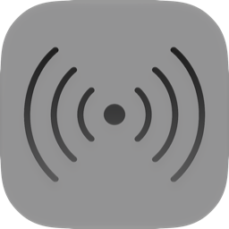
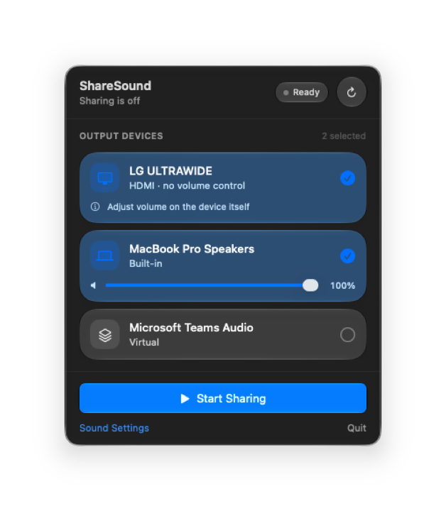

<div align="center">



# ShareSound

**Send your Mac's audio to two pairs of headphones at once.**

Watch a movie with a friend — same screen, same sound, two headsets.




</div>

---

## Why

macOS sends audio to one output at a time. You *can* build a Multi-Output Device
by hand in Audio MIDI Setup, but then:

- you rebuild it every time your headphones reconnect,
- the volume keys stop working, because they no longer reach the real devices,
- and if one headset drops out, you are left digging through settings mid-movie.

ShareSound is that setup as a menu bar app — one click to start, one to stop,
and it puts your system back exactly as it found it.

## Features

- **One-click sharing.** Pick two outputs, hit Start. The shared output is
  created, the system switches to it, and everything reverts when you stop.
- **Per-device volume.** Each headset gets its own slider — the thing the
  built-in Multi-Output Device cannot do.
- **Survives dropouts.** If a headset disconnects, sharing continues with the
  rest. Drop below two and it restores your previous output instead of leaving
  you in silence.
- **Live device list.** Headphones appear and disappear as you connect them; no
  refreshing needed.
- **No permissions.** Audio is routed, never captured — so no microphone or
  screen-recording prompts. It works the moment you launch it.
- **Stays out of the way.** Menu bar only, no Dock icon, reachable while a movie
  is full screen.

## Requirements

- macOS 26 or later (the interface uses Liquid Glass)
- Xcode 26+ command line tools, to build from source

## Install

Download the latest `.dmg` from [Releases](https://github.com/hakansoren/sharesound/releases)
and drag ShareSound onto Applications. The build is universal — one binary for
both Apple Silicon and Intel.

Because it is signed ad-hoc rather than with an Apple Developer ID, macOS will
not open it on the first double-click. Right-click the app, choose **Open**, and
confirm once.

### Building from source

```bash
git clone https://github.com/hakansoren/sharesound.git
cd sharesound
./Scripts/build-app.sh          # universal .app in dist/
./Scripts/build-dmg.sh          # and a distributable .dmg
cp -R dist/ShareSound.app /Applications/
```

To sign with your own Developer ID instead of ad-hoc:

```bash
CODESIGN_IDENTITY="Developer ID Application: Your Name (TEAMID)" ./Scripts/build-app.sh
```

## Usage

1. Connect both pairs of headphones.
2. Click the ShareSound icon in the menu bar.
3. Tick two devices and press **Start Sharing**.
4. Balance each headset with its own volume slider.
5. Press **Stop Sharing** when you're done — your previous output comes back.

A green dot on the menu bar icon means audio is currently being shared.

## How it works

ShareSound calls `AudioHardwareCreateAggregateDevice` with
`kAudioAggregateDeviceIsStackedKey`, which produces exactly the same kind of
virtual device Audio MIDI Setup creates: incoming audio is copied to every
member device. The app never touches the audio itself, it only routes it — which
is why it needs no permissions.

Every member except the clock master gets
`kAudioSubDeviceDriftCompensationKey`, so devices running on independent clocks
(Bluetooth, especially) stay aligned instead of slowly sliding apart. When
possible a wired device is chosen as the master, since its clock is the steadier
reference.

Full design notes: [design document](docs/superpowers/specs/2026-08-01-sharesound-design.md).

## Known limitation

Two Bluetooth headsets can sit a fixed distance apart in time — each has its own
codec latency. Drift compensation removes the *growing* gap, not the constant
one. Using one wired device makes it effectively disappear.

Adjusting that offset by hand would mean capturing system audio and running a
mixer, which is a much larger program; it is deliberately out of scope.

## Development

```bash
swift build          # build
swift test           # 51 tests, no hardware required
```

```
Sources/ShareSoundKit/   Decision logic + CoreAudio layer
Sources/ShareSound/      SwiftUI menu bar interface
Tests/                   Tests driven by an in-memory fake audio system
Scripts/                 Packaging, disk image and icon generation
Assets/                  Icon and logo sources
```

Release builds are universal (`arm64` + `x86_64`) with a macOS 26 deployment
target, so they run natively on Apple Silicon and on the Intel Macs that can
still run macOS 26. `UNIVERSAL=0 ./Scripts/build-app.sh` builds for the host
architecture only.

All decision logic lives in `ShareSessionController`, separated from CoreAudio by
two protocols. Tests drive it through `FakeAudioSystem`, which can connect and
disconnect devices and make any call fail — so failure and recovery paths are
covered without touching real hardware.

### Icon

The menu bar uses `Assets/logo-black.png` as a template image, so macOS tints it
for light and dark menu bars automatically; `Assets/logo-white.png` is the same
mark for dark backgrounds elsewhere. To regenerate the app icon from a
1024×1024 PNG:

```bash
./Scripts/make-icon.sh Assets/AppIcon-source.png
./Scripts/build-app.sh
```

## License

[MIT](LICENSE)
